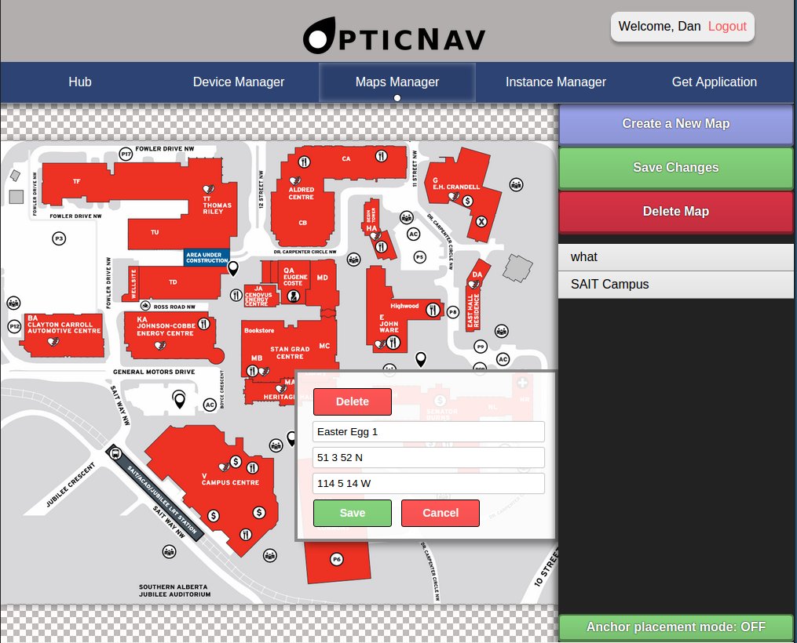
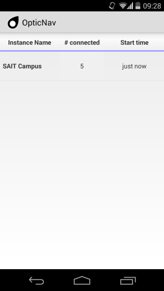
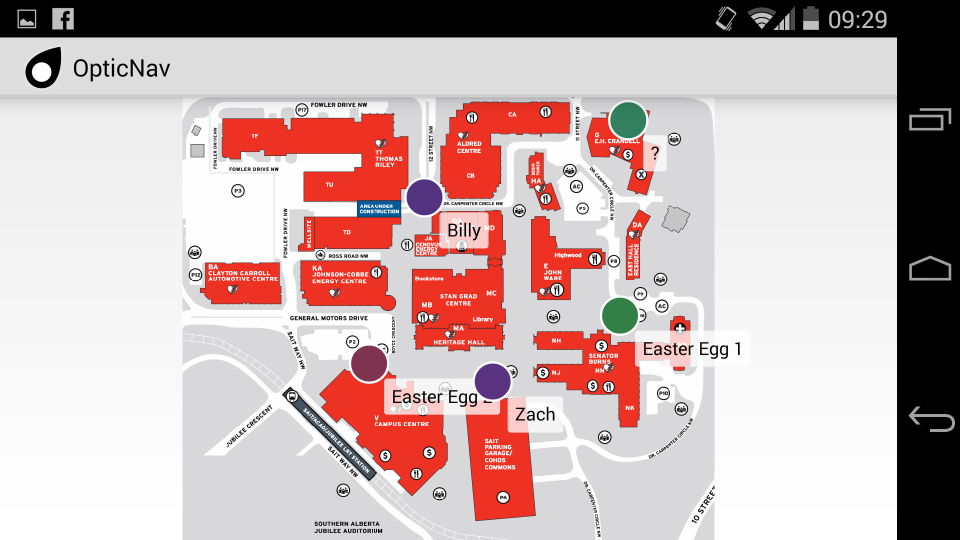

OpticNav
========


OpticNav is a proof-of-concept, multi-user augmented reality maps system.
It showcases one of the many potential applications in the world of augmented
reality.
It was worked on as part of the student Capstone project at SAIT Polytechnic.

The client for this project was the
[SAIT RADLab](https://github.com/SAITRADLab/).







Building and installing the project
-----------------------------------
For instructions on building and installing, see INSTALL.md

Docker images
-------------
See dockerfile/README.md for information on building

<https://registry.hub.docker.com/u/nukep/opticnav-daemon/>

<https://registry.hub.docker.com/u/nukep/opticnav-webapp/>

Gradle projects
---------------
The OpticNav project uses Gradle to automate building of projects and their
dependencies.

To get a full list of projects, enter in the project root:

```bash
gradle projects
```

### :ardd
OpticNav daemon application.

The daemon application listens for and services device requests, as well as
administration requests from the web application.

### :ardroid
OpticNav Android application.

### :web
OpticNav web application.

### Other projects
Other projects unlisted above are shared dependencies among :ardd, :ardroid, and
:web.

